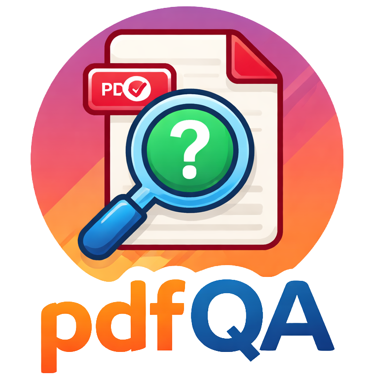

# pdfQA: Diverse, Challenging, and Realistic Question Answering over PDFs

<p align="center">
  
</p>

<p align="center">
  <b>Structured Benchmark for Document-Level QA over PDFs</b><br>
  Financial Reports · Sustainability Disclosures · Research Articles · Books
</p>

------------------------------------------------------------------------

## 📄 Paper

This repository accompanies the paper:

**pdfQA: Diverse, Challenging, and Realistic Question Answering over
PDFs**\
Tobias Schimanski, Imene Kolli, Yu Fan, Ario Saeid Vaghefi, Jingwei Ni,
Elliott Ash, Markus Leippold (2026)\
https://arxiv.org/abs/2601.02285

------------------------------------------------------------------------

## 🤗 Official Dataset on Hugging Face

The complete benchmark is hosted on Hugging Face:

👉 https://huggingface.co/datasets/pdfqa/pdfQA-Benchmark

We strongly recommend downloading the dataset from Hugging Face.

The repository supports:

-   Full dataset download
-   Category-level download
-   Dataset-level download
-   Folder-based download
-   File-based download

All official download scripts are provided in:

    tools/
     ├── download_using_bash/
     └── download_using_python/

#### Direct Hugging Face API

``` python
from huggingface_hub import hf_hub_download

hf_hub_download(
    repo_id="pdfqa/pdfQA-Benchmark",
    repo_type="dataset",
    filename="syn-pdfQA/01.2_Input_Files_PDF/books/file1.pdf"
)
```

------------------------------------------------------------------------

# Overview

`pdfQA` is a structured benchmark collection for **document-level
question answering and PDF understanding research**.

Unlike many QA benchmarks, pdfQA preserves:

-   Original PDFs\
-   Structured CSV annotations\
-   Raw source formats (HTML, TEX, XLSX, etc.)

This enables reproducible evaluation across preprocessing pipelines. It is particularly useful for:

-   Studying preprocessing impact
-   Comparing parsing strategies
-   OCR vs native PDF pipelines
-   Table extraction evaluation
-   End-to-end RAG benchmarking
-   Robustness to format variation

------------------------------------------------------------------------

# Dataset Structure

The repository follows a strict hierarchical layout:

    <category>/<type>/<dataset>/...

## Categories

-   `real-pdfQA/` --- Real-world benchmark datasets\
-   `syn-pdfQA/` --- Synthetic benchmark datasets

## File Types

Each dataset contains three subfolders:

-   `01.1_Input_Files_Non_PDF/` --- Raw source formats\
-   `01.2_Input_Files_PDF/` --- Original PDF documents\
-   `01.3_Input_Files_CSV/` --- Structured QA annotations

## Included Datasets

#### Real-World Benchmarks

-   ClimateFinanceBench
-   ClimRetrieve
-   FeTaQA
-   FinanceBench
-   FinQA
-   NaturalQuestions
-   PaperTab
-   PaperText
-   Tat-QA

#### Synthetic Benchmarks

-   books
-   financial_reports
-   sustainability_disclosures
-   research_articles

------------------------------------------------------------------------

## Data Fields

Each QA entry contains (depending on category):

| Field | Description |
|-------|-------------|
| file_type | Source dataset category |
| file_name | Document file name |
| question | Question text |
| answer | Ground-truth answer |
| sources* | Identifiers linking to raw data |
| source_text | Supporting spans |
| answer_type* | yes/no, value extraction, open-ended |
| answer_length* | Length of answer |
| reasoning* | Replication vs reasoning |
| question_difficulty* | simple / medium / hard |
| modalities* | text / table / mixed |
| num_sources* | Number of supporting spans |
| source_spread* | Distance between first and last span |
| sources_position* | Positional clustering proxy |
| file_length | Document length |

\* available for synthetic benchmarks

------------------------------------------------------------------------

# Why pdfQA?

This dataset is intended for:

- PDF parsing and layout understanding
- Financial and sustainability document QA
- Retrieval-augmented generation (RAG)
- Multi-modal document pipelines
- Table extraction and structured reasoning
- Robustness evaluation across preprocessing pipelines


------------------------------------------------------------------------

# Citation
If you use **pdfQA**, please cite:

``` bibtex
@misc{schimanski2026pdfqa,
      title={pdfQA: Diverse, Challenging, and Realistic Question Answering over PDFs}, 
      author={Tobias Schimanski and Imene Kolli and Yu Fan and Ario Saeid Vaghefi and Jingwei Ni and Elliott Ash and Markus Leippold},
      year={2026},
      eprint={2601.02285},
      archivePrefix={arXiv},
      primaryClass={cs.CL},
      url={https://arxiv.org/abs/2601.02285}, 
}
```

------------------------------------------------------------------------

# Links

Paper: https://arxiv.org/abs/2601.02285\
Hugging Face Dataset:
https://huggingface.co/datasets/pdfqa/pdfQA-Benchmark\
GitHub Repository: https://github.com/tobischimanski/pdfQA

------------------------------------------------------------------------

# Contact

For questions, please open an issue or contact:

tobias.schimanski@df.uzh.ch
